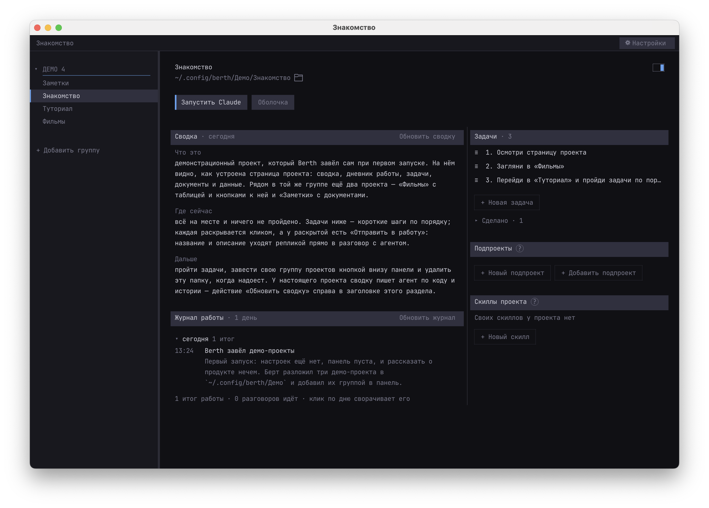
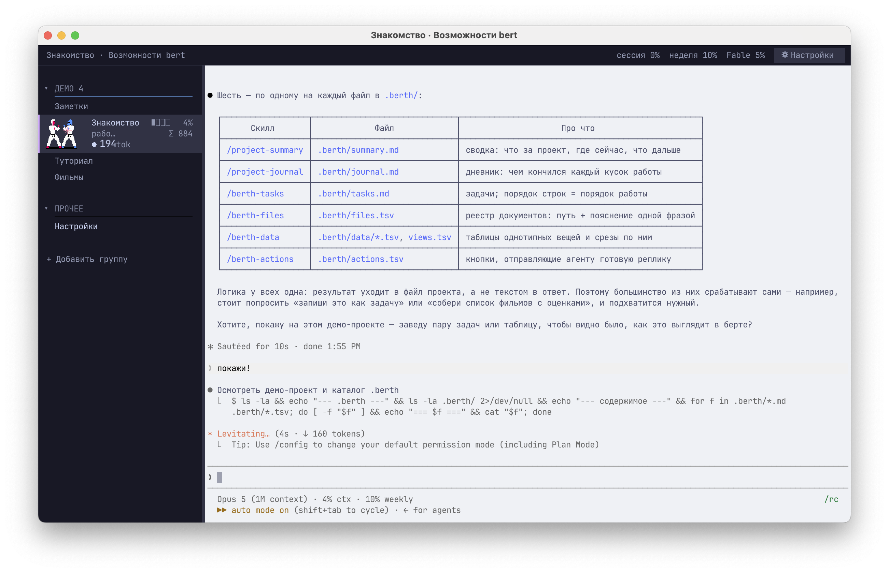
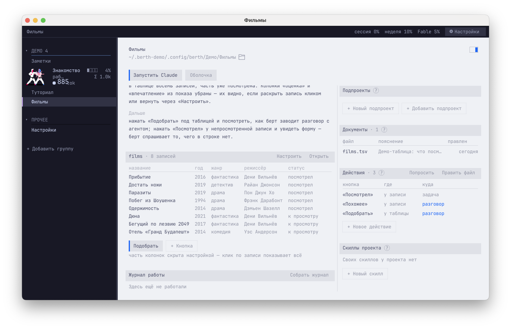

# Berth

**Терминал, в котором проект и сессия агента — первоклассные сущности, а не
случайная вкладка со случайным рабочим каталогом.**

[](LICENSE)




Внутри настоящий терминал. Ядро —
[libghostty-vt](https://github.com/ghostty-org/ghostty): разбор VT, состояние
экрана, рефлоу, скроллбэк, Kitty-протоколы клавиатуры и графики. Окно, ввод и
отрисовка — raylib. Всё остальное своё: C, 35 модулей, без Electron.

> **Статус:** рабочий прототип, которым автор пользуется каждый день. macOS,
> сборка из исходников. Что дальше — [ROADMAP.md](ROADMAP.md); как устроено и
> почему именно так — [CLAUDE.md](CLAUDE.md).

## Попробовать

Нужны `zig`, `git`, `curl`, `make`, `python3`. Полного Xcode не нужно, хватает
Command Line Tools.

```sh
git clone https://github.com/penopg/Berth
cd Berth
./build.sh          # первый запуск собирает зависимости, это несколько минут
./build/berth
```

При первом запуске Berth заводит четыре демо-проекта и открывает страницу
«Знакомства»: рассказ о том, как всё устроено, туториал из десяти шагов,
таблица с кнопками и документы. Пройти туториал — самый быстрый способ понять
продукт: половина шагов делается руками, половина уходит агенту одной кнопкой.
Потом группу «Демо» можно скрыть крестиком у заголовка, а папку
`~/.config/berth/Демо` — удалить.

Посмотреть первый запуск ещё раз, не трогая свои настройки, можно отдельным
домом для файлов Berth — настоящий `$HOME` при этом остаётся на месте, так что
вход в агента и связка ключей работают:

```sh
BERTH_HOME=~/.berth-demo ./build/berth   # убрать: rm -rf ~/.berth-demo
```

Приложение с иконкой, чтобы запускать из Dock:

```sh
./bundle.sh
cp -R build/Berth.app /Applications/
```

Бандл запускает оболочку как login shell — иначе запущенному из Dock
приложению не досталось бы ни `claude`, ни `git`.

## Что умеет

- **Вкладка — это проект,** а не оболочка в каталоге. У неё есть страница:
  сводка, дневник работы, задачи, документы, данные. После перезапуска
  поднимается тот самый диалог с агентом, а не пустой терминал.
- **Один живой разговор на проект.** Всё, что было раньше, — история, к
  которой возвращаются через журнал, а не десять процессов, ждущих неизвестно
  чего.
- **Панель со всеми проектами:** группы, подпроекты, состояние агента,
  занятый контекст, давность работы. Десять проектов на экране, и видно, кому
  ты нужен.


- **Память проекта лежит в проекте** — текстовые файлы в `.berth/`, которые
  уезжают с репозиторием: сводка, задачи, дневник, реестр документов, таблицы
  данных, кнопки действий.
- **Задачи** списком с перетаскиванием. «Отправить в работу» отдаёт задачу
  агенту репликой, а он, закончив, сам отмечает её в файле.
- **Таблицы данных** показываются прямо на странице: сортировка кликом по
  заголовку, выбор и порядок колонок, раскрытие записи целиком.
- **Действия** — кнопки у записи или у таблицы: Berth подставляет значения из
  строки в заготовку и отправляет агенту. Чего в строке нет — спрашивает
  формой. В сами данные Berth не пишет никогда: пишет тот, кто и так пишет.


- **Лимиты Claude Code** в верхней полосе: пятичасовое окно и недельные, с
  временем сброса.
- **Темы:** панель и окно красятся порознь, так что рабочее тёмное и личное
  светлое живут в одном окне одновременно.

## Зачем

Терминал это процессы. Приложения агентов (Claude Desktop, приложение
Codex) это чат, к которому подключили файлы. IDE с агентом (Cursor,
Windsurf, VS Code с Copilot) это редактор, к которому пристроили чат.
Berth это рабочее место для проектов и агентов: внутри настоящий терминал,
память проекта лежит в самом проекте, а агент это тот CLI, который у тебя
уже стоит, от любого вендора.

**Единица работы это проект.** Папка, разговор с агентом, задачи и
история. Вкладка в Berth это проект, а не оболочка в каталоге: у неё есть
страница с журналом, задачами и сводкой, её нельзя потерять, можно только
отойти. После перезапуска поднимается не терминал, а тот самый диалог с
агентом.

**Память проекта лежит в проекте.** Журнал сшивается из истории, которую
агент и так пишет, и итогов, которые он пишет по просьбе Berth. Рядом
задачи и сводка. Это файлы в `.berth/`: едут с репозиторием, читаются
человеком, правятся агентом, видны любому инструменту. Открыл проект через
месяц и за минуту видишь, что было, где сейчас и что дальше.

**Агенты видны все разом.** В панели у каждого проекта состояние агента,
занятый контекст и давность работы, в полосе лимиты. Десять проектов на
экране, и видно, кому ты нужен.

**Агент это профиль, а не вендор.** Berth не приносит своего агента: он
запускает тот, что установлен, с его скиллами, настройками и подпиской, и
читает то, что тот пишет на диск. Модель «проект, разговор, журнал,
задачи» от вендора не зависит, и ничто в ней не мешает Claude Code и Codex
работать в одном проекте рядом. Сегодня полностью поддержан Claude Code.

**Это GUI, а не TUI.** Страницы с прокруткой, перетаскивание задач мышью,
карточки, живые маркеры состояния. При этом внутри настоящий терминал на
libghostty, тот же движок, что у Ghostty, на C и без Electron.

### Чем не терминал

iTerm2, Warp, WezTerm, tmux с менеджерами сессий построены вокруг сессий.
Сессия это процесс: закрыл окно, и от неё осталась история команд. Проект
для них это `cd`.

| | Терминал | Berth |
|---|---|---|
| Вкладка | оболочка в каталоге | проект: папка, разговор, задачи, журнал |
| После перезапуска | пустая оболочка, в лучшем случае каталог | тот же разговор с агентом, страница проекта |
| Агент | ещё одна программа во вкладке | сущность: состояние, контекст, лимиты в панели |
| История работы | скроллбэк, пока не закрыл | журнал в `.berth/`, навсегда и в git |
| Интерфейс | текстовый | GUI: страницы, перетаскивание, анимация |

### Чем не приложение агента

Claude Desktop, приложение Codex и подобные дают одного агента одного
вендора в окне чата.

| | Приложение агента | Berth |
|---|---|---|
| Где работаешь | окно чата; тесты, логи, редактор где-то ещё | терминал: агент и твои руки в одном окне |
| Проект | сущность приложения, живёт в облаке | папка на диске, которая у тебя уже есть |
| Память | история внутри приложения | журнал, задачи, сводка в репозитории, видны коллеге и git |
| Агент | свой, одного вендора | тот CLI, что у тебя стоит: Claude Code, Codex, любой |
| Несколько проектов | по одному, переключением | все в одной панели, с состоянием каждого |
| Данные | у вендора | локально; наружу только запрос лимитов |

### Чем не IDE с агентом

Cursor, Windsurf, Copilot делают агента частью редактора. Это правильно,
пока работа это правка кода в одном репозитории.

| | IDE с агентом | Berth |
|---|---|---|
| Центр | редактор, агент сбоку | проект и разговор, редактор любой |
| Окно | один репозиторий | все проекты, кодовые и нет |
| Агент | встроен в IDE | внешний CLI, меняется без смены инструмента |
| Память проекта | правила и чат внутри IDE | журнал, задачи, сводка в `.berth/`, читаются без IDE |
| Не-код | нет | папка с задачами и разговором: мониторинг, отчёты, процессы |

### Что честно у них лучше

Приложения агентов умеют чат с картинками, браузер и экран, подключают
коннекторы кнопкой и не заставляют открывать терминал. IDE лучше
показывает диффы и даёт править код рядом с агентом. Berth пока только для
macOS, на ранней стадии: нет выделения мышью и копирования из терминала,
полностью поддержан один агент, собирается из исходников. Berth для тех,
кто живёт в терминале и ведёт много проектов с агентами сразу.

## Память проекта

Всё, что Berth знает о проекте, лежит в самом проекте и уезжает с
репозиторием:

| файл | что в нём |
|---|---|
| `.berth/summary.md` | сводка: что это, где сейчас, что дальше |
| `.berth/tasks.md` | задачи; порядок строк в файле и есть порядок работы |
| `.berth/journal.md` | дневник: чем кончился каждый кусок работы |
| `.berth/files.tsv` | реестр документов: путь и пояснение одной фразой |
| `.berth/data/*.tsv` | таблицы с данными |
| `.berth/actions.tsv` | кнопки, отправляющие агенту готовую реплику |

Формат текстовый и простой намеренно: файлы читает человек, пишет агент,
видит любой инструмент. Пишет их агент — у Berth есть четыре встроенных
скилла (`berth-tasks`, `berth-data`, `berth-files`, `berth-actions`), которые
едут в бинаре и подключаются к каждому запуску агента через `--add-dir`.

## Откуда берутся проекты

- **Своя папка:** «+ Добавить группу» внизу панели — её подпапки становятся
  проектами. Хранится в `~/.config/berth/groups.tsv`.
- **Подпроекты:** папки внутри проекта со своей историей, паспортом или
  `.berth/`; находятся сами, исключения — в `.berth/subprojects.tsv`.
- **`~/.claude/warp-tabs/projects.json`**, если у вас есть система вкладок
  Warp: оттуда берутся имя, группа, цвет и тема.
- **Аргументом командной строки:** `./build/berth ~/work/api ~/personal/blog`.
- **Демо-проекты** при первом запуске.

Списки перечитываются по времени правки файла — перезапуск не нужен.

## Горячие клавиши

| | |
|---|---|
| `⌘T` / `⌘W` | открыть / закрыть вкладку |
| `⌘Q` | выйти, погасив все сессии |
| `⌘1`…`⌘9` | вкладка по порядку в панели |
| `⌘⇧[` / `⌘⇧]` | предыдущая / следующая |
| `⌘I` | страница проекта |
| `⌘,` | настройки |
| `⌘B` | показать или спрятать панель |
| `⌘R` | перечитать список проектов |
| `⌘K` | почистить контекст агента |
| `⌘+` / `⌘−` / `⌘0` | размер шрифта |
| `⌘V` | вставить из буфера (текст, картинку или файл) |

Клик по проекту открывает в нём агента; если у проекта есть прошлые сессии,
диалог продолжается сам. Повторный клик по открытому показывает его страницу.
`⌘T` даёт вспомогательную оболочку вне проекта.

## Устройство

35 модулей, около 19 тысяч строк C. Слои разделены намеренно.

```
src/
  окно и цикл      app.c  layout.c  ui.c  input.c  theme.c  ctx.c
  терминал         term.c  pty.c  render.c  font.c  utf8.c  sprite.c  scene.c
  проект           session.c  projects.c  projstate.c  projinfo.c
                   subprojects.c  groups.c
  страница         page.c
  память проекта   journal.c  tasks.c  files.c  table.c  actions.c
                   skills.c  demo.c
  агент и лимиты   agent.c  claude.c  usage.c  xp.c  skills_builtin.c
  прочее           settings.c  json.c  macos.m
```

`Term` знает про VT и дочерний процесс и ничего не знает про проекты и
агентов; `Session` — наоборот, и весит 1.2 КБ: всё, что принадлежит проекту,
живёт в кэше по каталогу (`projstate.c`), а не в каждой вкладке. Раскладка
(`layout.c`) отдельно от отрисовки (`ui.c`): клик проверяется по тем же
прямоугольникам, по которым рисуется панель. Страница рисуется и обрабатывает
клики в один проход — immediate mode.

Официальный путь сборки через CMake не используется: `build.zig` у ghostty
конструирует XCFramework под iOS, а это требует полного Xcode. Поэтому
`build.sh` собирает libghostty-vt адресно
(`zig build -Demit-lib-vt=true -Demit-xcframework=false`) и линкует напрямую.

## Чего пока нет

- **выделения мышью и копирования из терминала** — самое заметное;
- сплитов;
- цветных эмодзи (нужно читать таблицу sbix у Apple Color Emoji);
- ширин двухклеточных символов (CJK);
- `⌘W` закрывает окно, а не вкладку;
- готовой подписанной сборки: `.app` собирается локально, для передачи файлом
  нужны Developer ID и нотаризация;
- Linux и Windows: пока только macOS.

## Лицензия

MIT — см. [LICENSE](LICENSE). Часть кода производна от
[Ghostling](https://github.com/mitchellh/ghostling). Полный список третьих
сторон и зафиксированных версий — в [NOTICE.md](NOTICE.md).
